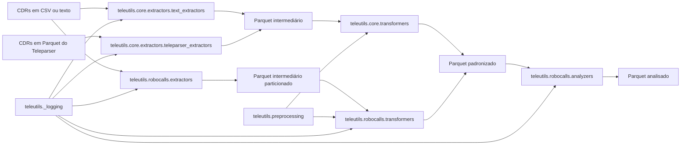

[](https://deepwiki.com/InovaFiscaliza/teleutils)

# TeleUtils

TeleUtils é uma biblioteca Python para extrair, transformar, normalizar e analisar CDRs (Call Detail Records) de operadoras brasileiras com Apache Spark.

> Documentação complementar publicada no DeepWiki: [InovaFiscaliza/teleutils](https://deepwiki.com/InovaFiscaliza/teleutils). Use este README como guia principal para instalação, API pública e exemplos executáveis; consulte o DeepWiki para uma visão arquitetural mais ampla e páginas temáticas detalhadas.

## Visão Geral

O projeto resolve o problema de lidar com CDRs heterogêneos, com layouts diferentes por operadora e fornecedor, e converte esses dados em um formato consistente para análise.

O TeleUtils é útil quando você precisa:

- ler CDRs em CSV, texto ou Parquet;
- padronizar colunas, datas, horários, durações e números telefônicos;
- validar CNPJs em lote, inclusive dentro do Spark;
- identificar padrões de chamadas curtas, autenticação e caixa postal;
- gerar Parquets intermediários e finais para processamento analítico.

O público esperado inclui analistas de dados, engenheiros de dados, equipes antifraude, times de inteligência operacional e qualquer pessoa que precise processar CDRs sem conhecer previamente o domínio de telecomunicações.

O pacote está organizado em duas famílias principais:

- `teleutils.core`, que concentra extratores e transformadores genéricos por layout;
- `teleutils.robocalls`, que implementa o fluxo voltado à detecção de chamadas abusivas.

## Início Rápido

### Pré-requisitos

- Python 3.9 ou superior;
- Java/JDK compatível com Apache Spark 3.5.5;
- Apache Spark disponível no ambiente quando você for executar pipelines locais ou conectados a cluster;
- acesso aos arquivos de CDR em um dos formatos suportados.

### Instalação

```bash
git clone https://github.com/InovaFiscaliza/teleutils.git
cd teleutils
python -m venv .venv
source .venv/bin/activate
python -m pip install -U pip
python -m pip install -e .
```

Se você também for desenvolver no projeto, instale as dependências de apoio e os hooks de qualidade:

```bash
python -m pip install pytest pre-commit jupyter matplotlib
pre-commit install
```

### Verificação da Instalação

```bash
python - <<'PY'
from teleutils.preprocessing import normalize_number, validar_cnpj

print(normalize_number("(11) 99999-9999"))
print(validar_cnpj("11222333000181"))
PY
```

Saída esperada:

```text
('11999999999', True)
True
```

Se você quiser confirmar a integração com Spark, rode também:

```bash
python - <<'PY'
from pyspark.sql import SparkSession
from teleutils.preprocessing import spark_normalize_number

spark = SparkSession.builder.master("local[*]").appName("teleutils-check").getOrCreate()
df = spark.createDataFrame([("11999999999",)], ["numero"])
df = df.withColumn("normalizado", spark_normalize_number("numero"))
df.select("normalizado.numero_formatado", "normalizado.numero_valido").show()
spark.stop()
PY
```

## Arquitetura

A arquitetura atual segue um fluxo em camadas. Os módulos de `preprocessing` são reutilizados pelas duas linhas de processamento, enquanto `core` e `robocalls` implementam contratos e regras de negócio distintos.



### Componentes principais

- `teleutils.preprocessing` concentra normalização de números e validação de CNPJ.
- `teleutils.core.extractors` mapeia CDRs brutos para um esquema intermediário por fornecedor e layout.
- `teleutils.core.transformers` transforma o esquema intermediário em um contrato final padronizado.
- `teleutils.robocalls.extractors` lê CDRs de operadoras em layouts específicos voltados à análise de chamadas abusivas.
- `teleutils.robocalls.transformers` aplica heurísticas de chamada curta, autenticação e caixa postal.
- `teleutils.robocalls.analyzers` agrega os dados transformados por número e hora.

### Fluxo de execução

1. A extração lê o arquivo de origem e seleciona apenas as colunas relevantes.
2. A transformação padroniza números, datas, durações e indicadores operacionais.
3. A análise agrupa o resultado final e calcula métricas de volume e suspeição.

## Estrutura do Projeto

```text
README.md
pyproject.toml
.pre-commit-config.yaml
docs/
  How_to_Use_This_Template.md
src/
  teleutils/
    __init__.py
    _config.py
    _logging.py
    core/
      __init__.py
      extractors/
        __init__.py
        schemas.py
        teleparser_extractors.py
        text_extractors.py
      transformers/
        __init__.py
        base_transformer.py
        teleparser_transformers.py
        text_transformers.py
    preprocessing/
      __init__.py
      number_format.py
      utils.py
    robocalls/
      __init__.py
      analyzers.py
      extractors.py
      transformers.py
tests/
  assets/
    sample_numbers.parquet
  debug_normalize_numbers.py
  notebooks/
    desenvolvimento_chamadas_abusivas.ipynb
    desenvolvimento_extrator_universal.ipynb
    preprocessing_analysis.ipynb
  test_example.py
  test_normalize_number.py
  tests.py
```

### Finalidade dos diretórios relevantes

- `src/teleutils`: implementação principal da biblioteca.
- `src/teleutils/core`: camada genérica de extração e transformação por layout.
- `src/teleutils/preprocessing`: funções reutilizáveis de normalização e validação.
- `src/teleutils/robocalls`: pipeline voltado à identificação de chamadas abusivas.
- `tests`: testes automatizados, scripts de apoio e notebooks experimentais de desenvolvimento.
- `docs`: documentação de apoio ao uso do template do repositório.

## Referência da API

### `teleutils.preprocessing`

Pacote público que reexporta as funções de normalização de números telefônicos e de validação de CNPJ.

#### Funções

##### `normalize_number(subscriber_number, national_destination_code="")`

Normaliza um número telefônico brasileiro e retorna uma tupla com o número formatado e um indicador de validade.

Parâmetros principais:

- `subscriber_number`: número bruto de entrada;
- `national_destination_code`: DDD usado para completar números locais de 8 ou 9 dígitos.

Retorno:

- `tuple[str | None, bool]`: número normalizado e flag de validade.

Comportamento relevante:

- remove prefixos de discagem nacionais e internacionais;
- trata números separados por ponto e vírgula mantendo o primeiro valor;
- remove o caractere `f` usado por alguns sistemas legados;
- quando a entrada é inválida, retorna o valor original e `False`;
- quando a entrada é vazia, retorna `(None, False)`.

Exemplo:

```python
from teleutils.preprocessing import normalize_number

numero, valido = normalize_number("(11) 99999-9999")
print(numero)
print(valido)
```

Saída esperada:

```text
11999999999
True
```

##### `normalize_number_pair(number_a, number_b, national_destination_code="")`

Normaliza um par de números telefônicos e usa o primeiro número como contexto para inferir o DDD do segundo quando necessário.

Parâmetros principais:

- `number_a`: número de origem;
- `number_b`: número de destino;
- `national_destination_code`: DDD inicial opcional.

Retorno:

- `tuple[str, bool, str, bool]`: número A formatado e válido, número B formatado e válido.

Exemplo:

```python
from teleutils.preprocessing import normalize_number_pair

a_fmt, a_ok, b_fmt, b_ok = normalize_number_pair("1133334444", "22225555")
print(a_fmt, a_ok)
print(b_fmt, b_ok)
```

##### `spark_normalize_number(number_series)`

UDF vetorizada para Spark que aplica `normalize_number` em lote.

Retorno:

- `DataFrame` com as colunas `numero_formatado` e `numero_valido`.

Exemplo:

```python
from pyspark.sql import SparkSession
from pyspark.sql import functions as F
from teleutils.preprocessing import spark_normalize_number

spark = SparkSession.builder.master("local[*]").appName("teleutils-normalize").getOrCreate()
df = spark.createDataFrame([("11999999999",), ("numero_invalido",)], ["numero"])
df = df.withColumn("normalizado", spark_normalize_number("numero"))
df.select(
    "numero",
    F.col("normalizado.numero_formatado").alias("numero_formatado"),
    F.col("normalizado.numero_valido").alias("numero_valido"),
).show()
```

##### `validar_cnpj(cnpj)`

Valida um CNPJ no Python puro.

Retorno:

- `bool`: `True` quando o CNPJ é válido; `False` caso contrário.

Comportamento relevante:

- remove máscara e caracteres não numéricos;
- rejeita sequências triviais;
- valida os dois dígitos verificadores.

Exemplo:

```python
from teleutils.preprocessing import validar_cnpj

print(validar_cnpj("11222333000181"))
```

##### `spark_validar_cnpj(cnpj_series)`

UDF vetorizada para Spark que valida uma série de CNPJs.

Retorno:

- `DataFrame` com a coluna `cnpj_valido`.

Exemplo:

```python
from pyspark.sql import SparkSession
from teleutils.preprocessing import spark_validar_cnpj

spark = SparkSession.builder.master("local[*]").appName("teleutils-cnpj").getOrCreate()
df = spark.createDataFrame([("11222333000181",), ("00000000000000",)], ["cnpj"])
df = df.withColumn("validacao", spark_validar_cnpj("cnpj"))
df.select("cnpj", "validacao.cnpj_valido").show()
```

### `teleutils.core.extractors.schemas`

Módulo de configuração dos esquemas do Teleparser.

#### Classes

##### `CDRTeleparserSchema`

Dataclass imutável que descreve o mapeamento de colunas de um layout Teleparser.

Parâmetros principais:

- `name`: nome amigável do layout;
- `column_mapping`: lista de pares `(origem, destino)`;
- `job_description`: descrição do job para uso em logs e Spark UI.

Validação automática:

- `column_mapping` não pode ser vazio;
- cada item deve ser uma tupla de duas strings.

Exemplo:

```python
from teleutils.core.extractors.schemas import TELEPARSER_DEFAULT_SCHEMAS

schema = TELEPARSER_DEFAULT_SCHEMAS["ericsson"]
print(schema.name)
```

#### Constantes

##### `TELEPARSER_DEFAULT_SCHEMAS`

Dicionário com os esquemas padrão dos layouts `ericsson`, `tim_huawei`, `vivo_fcdr` e `nokia`.

### `teleutils.core.extractors.text_extractors`

Módulo de extração de CDRs em CSV ou texto para um parquet intermediário.

#### Classes

##### `CDRSchema`

Configuração imutável para leitura e mapeamento de um layout de CDR textual.

Parâmetros principais:

- `name`: nome do layout;
- `delimiter`: delimitador do arquivo;
- `schema`: schema Spark opcional;
- `has_header`: indica presença de cabeçalho;
- `column_to_filter`: filtro opcional `("coluna", "valor")`;
- `column_indices`: índices das colunas a selecionar;
- `column_names`: nomes finais na saída;
- `job_description`: descrição do job.

##### `CDRTextExtractor`

Extrator para layouts textuais. Escreve o resultado em Parquet e preserva metadados de linhagem.

Métodos públicos:

- `extract_cdr_ericsson(source_file, target_file)`
- `extract_cdr_tim_huawei(source_file, target_file)`
- `extract_cdr_vivo_fcdr(source_file, target_file)`
- `extract_cdr_nokia(source_file, target_file)`

Detalhes úteis:

- `extract_cdr_tim_huawei` usa schema Spark explícito porque o cabeçalho nem sempre é confiável;
- `extract_cdr_nokia` tolera variações de colunas ausentes;
- a saída é gravada em Parquet com a coluna `tipo_de_chamada` particionada no pipeline de robocalls;
- os metadados `prestadora`, `tipo_cdr` e `arquivo_origem` são derivados do caminho do arquivo.

Exemplo:

```python
from pyspark.sql import SparkSession
from teleutils.core.extractors import CDRTextExtractor

spark = SparkSession.builder.master("local[*]").appName("teleutils-text").getOrCreate()
extractor = CDRTextExtractor(spark)
df = extractor.extract_cdr_ericsson("dados/ericsson.csv", "saida/ericsson_extracted")
df.show(5)
```

### `teleutils.core.extractors.teleparser_extractors`

Módulo de extração de CDRs em Parquet produzidos pelo Teleparser.

#### Classes

##### `CDRTeleparserExtractor`

Extrator para layouts Teleparser com mapeamento por fornecedor.

Construtor:

- `CDRTeleparserExtractor(spark, schemas=None)`;
- quando `schemas` não é informado, usa `TELEPARSER_DEFAULT_SCHEMAS`.

Métodos públicos:

- `extract_cdr_ericsson(source_file, target_file)`
- `extract_cdr_tim_huawei(source_file, target_file)`
- `extract_cdr_vivo_fcdr(source_file, target_file)`
- `extract_cdr_nokia(source_file, target_file)`

Detalhes úteis:

- aceita colunas aninhadas com notação de ponto;
- grava os resultados em Parquet;
- `extract_cdr_nokia` ignora colunas ausentes quando necessário.

Exemplo:

```python
from pyspark.sql import SparkSession
from teleutils.core.extractors import CDRTeleparserExtractor

spark = SparkSession.builder.master("local[*]").appName("teleutils-teleparser").getOrCreate()
extractor = CDRTeleparserExtractor(spark)
df = extractor.extract_cdr_nokia("dados/nokia_parquet", "saida/nokia_extracted")
df.show(5)
```

### `teleutils.core.transformers.base_transformer`

Módulo base de transformação compartilhado pelos transformadores do pacote `core`.

#### Classes

##### `CDRBaseTransformer`

Classe base para padronização de CDRs.

Esse componente não é o ponto de entrada principal do projeto, mas centraliza as regras reutilizadas pelos transformadores específicos.

Responsabilidades principais:

- normalizar `data_hora` e `duracao`;
- padronizar números de origem e destino com `spark_normalize_number`;
- derivar a coluna `autenticacao` a partir de `_autenticacao` quando existir;
- selecionar e renomear as colunas finais do contrato padronizado;
- gravar o resultado final em Parquet.

### `teleutils.core.transformers.text_transformers`

Módulo de transformação para CDRs extraídos por texto ou CSV.

#### Classes

##### `CDRTextTransformer`

Transformador com contrato de saída estável para os layouts textuais.

Métodos públicos:

- `transform_cdr_ericsson(source_file, target_file)`
- `transform_cdr_nokia(source_file, target_file)`
- `transform_cdr_tim_huawei(source_file, target_file)`
- `transform_cdr_vivo_fcdr(source_file, target_file)`

Saída principal:

- `nu_referencia`
- `nu_origem_original`
- `nu_destino_original`
- `nu_origem`
- `ic_origem_valido`
- `nu_destino`
- `ic_destino_valido`
- `dh_chamada`
- `qt_duracao_segundos`
- `no_tipo_chamada`
- `no_autenticacao`
- `no_rota_entrada`
- `no_rota_saida`
- `no_prestadora`
- `no_tipo_cdr`
- `no_arquivo_origem`

Notas relevantes:

- o módulo é tratado como contrato estável;
- `transform_cdr_nokia` corrige a referência BCD, deriva rotas e ajusta o tipo de chamada;
- `transform_cdr_vivo_fcdr` separa autenticação embutida em `numero_origem`.

Exemplo:

```python
from pyspark.sql import SparkSession
from teleutils.core.transformers import CDRTextTransformer

spark = SparkSession.builder.master("local[*]").appName("teleutils-text-transform").getOrCreate()
transformer = CDRTextTransformer(spark)
df = transformer.transform_cdr_ericsson("saida/ericsson_extracted", "saida/ericsson_transformed")
df.show(5)
```

### `teleutils.core.transformers.teleparser_transformers`

Módulo de transformação para CDRs vindos do Teleparser.

#### Classes

##### `CDRTeleparserTransformer`

Transformador baseado em `CDRBaseTransformer` para layouts Teleparser.

Métodos públicos:

- `transform_cdr_ericsson(source_file, target_file)`
- `transform_cdr_tim_huawei(source_file, target_file)`
- `transform_cdr_vivo_fcdr(source_file, target_file)`
- `transform_cdr_nokia(source_file, target_file)`

Detalhes úteis:

- TIM Huawei e Vivo FCDR aplicam regras específicas de tipo de chamada e autenticação;
- Nokia consolida durações, data/hora e rotas com base em colunas variantes do layout;
- a persistência final continua sendo Parquet.

### `teleutils.robocalls`

Pacote público que reexporta `RoboCallsExtractor`, `RoboCallsTransformer` e `RoboCallsAnalyzer`.

#### Classes

##### `RoboCallsExtractor`

Extrai CDRs em CSV para o fluxo de análise de chamadas abusivas.

Métodos públicos:

- `extract_cdr_ericsson(source_file, target_file)`
- `extract_cdr_tim_volte(source_file, target_file)`
- `extract_cdr_vivo_volte(source_file, target_file)`
- `extract_cdr_claro_nokia(source_file, target_file)`

Comportamento relevante:

- grava Parquet intermediário particionado por `tipo_de_chamada`;
- usa esquemas de coluna específicos por layout;
- os formatos suportados nesta camada são distintos dos formatos de `teleutils.core`.

Exemplo:

```python
from pyspark.sql import SparkSession
from teleutils.robocalls import RoboCallsExtractor

spark = SparkSession.builder.master("local[*]").appName("teleutils-robocalls-extract").getOrCreate()
extractor = RoboCallsExtractor(spark)
df = extractor.extract_cdr_tim_volte("dados/tim_volte.csv", "saida/tim_volte_extracted")
df.show(5)
```

##### `RoboCallsTransformer`

Transforma os CDRs extraídos para um esquema analítico unificado.

Construtor:

- `RoboCallsTransformer(spark, limiar_chamada_ofensora=6)`.

Métodos públicos:

- `transform_cdr_ericsson(source_file, target_file)`
- `transform_cdr_tim_volte(source_file, target_file)`
- `transform_cdr_vivo_volte(source_file, target_file)`
- `transform_cdr_claro_nokia(source_file, target_file)`

Colunas principais da saída:

- `referencia`
- `tipo_de_chamada`
- `data_hora`
- `numero_de_a_formatado`
- `numero_de_b_formatado`
- `hora_da_chamada`
- `duracao_da_chamada`
- `chamada_curta`
- `chamada_autenticada`
- `chamada_caixa_postal`

Semântica dos indicadores:

- `chamada_curta`: `1` quando a duração é menor ou igual ao limiar;
- `chamada_autenticada`: `-1` para falha, `0` para não verificada e `1` para autenticada;
- `chamada_caixa_postal`: `1` quando o registro indica encaminhamento para caixa postal.

Detalhes relevantes por formato:

- TIM VoLTE identifica caixa postal por registros `FORv` relacionados a `TERv`;
- Vivo VoLTE separa autenticação embutida no número de origem e cruza registros por referência, data e destino;
- Claro Nokia consolida `MTC`, `UCA`, `FOR`, `MOC` e usa heurísticas para `PTC` e `POC`;
- Ericsson força `chamada_autenticada` e `chamada_caixa_postal` para `0`.

Exemplo:

```python
from pyspark.sql import SparkSession
from teleutils.robocalls import RoboCallsTransformer

spark = SparkSession.builder.master("local[*]").appName("teleutils-robocalls-transform").getOrCreate()
transformer = RoboCallsTransformer(spark)
df = transformer.transform_cdr_tim_volte("saida/tim_volte_extracted", "saida/tim_volte_transformed")
df.select(
    "referencia",
    "numero_de_a_formatado",
    "numero_de_b_formatado",
    "chamada_curta",
    "chamada_autenticada",
    "chamada_caixa_postal",
).show(5)
```

##### `RoboCallsAnalyzer`

Agrega o parquet transformado e calcula métricas por número originador e hora.

Método público:

- `analyze(source_file, target_file="")`

Retorno:

- `DataFrame` com as colunas `numero_de_a_formatado`, `hora_da_chamada`, `total_chamadas`, `total_chamadas_curtas`, `total_chamadas_caixa_postal`, `total_chamadas_autenticadas`, `total_chamadas_curtas_autenticadas` e `total_chamadas_caixa_postal_autenticadas`.

Observação importante:

- sempre informe `target_file` com um caminho válido; o valor padrão vazio existe na assinatura, mas não é útil para execução real.

Exemplo:

```python
from pyspark.sql import SparkSession
from teleutils.robocalls import RoboCallsAnalyzer

spark = SparkSession.builder.master("local[*]").appName("teleutils-robocalls-analyze").getOrCreate()
analyzer = RoboCallsAnalyzer(spark)
df = analyzer.analyze("saida/tim_volte_transformed", "saida/tim_volte_analyzed")
df.orderBy("total_chamadas_curtas", ascending=False).show(10)
```

## Guias de Uso

### Uso Básico

Para normalizar um número e validar um CNPJ no Python puro:

```python
from teleutils.preprocessing import normalize_number, validar_cnpj

print(normalize_number("0800-123-4567"))
print(validar_cnpj("11222333000181"))
```

### Uso Avançado em Spark

Para aplicar normalização e validação em lote, use as UDFs vetorizadas:

```python
from pyspark.sql import SparkSession
from pyspark.sql import functions as F
from teleutils.preprocessing import spark_normalize_number, spark_validar_cnpj

spark = SparkSession.builder.master("local[*]").appName("teleutils-spark-guide").getOrCreate()
df = spark.createDataFrame(
    [("11999999999", "11222333000181"), ("numero_invalido", "00000000000000")],
    ["numero", "cnpj"],
)

df = df.withColumn("numero_norm", spark_normalize_number("numero"))
df = df.withColumn("cnpj_norm", spark_validar_cnpj("cnpj"))

df.select(
    "numero",
    F.col("numero_norm.numero_formatado").alias("numero_formatado"),
    F.col("numero_norm.numero_valido").alias("numero_valido"),
    F.col("cnpj_norm.cnpj_valido").alias("cnpj_valido"),
).show()
```

### Pipeline Completo de Robocalls

Use esta sequência quando o objetivo for identificar chamadas abusivas:

```python
from pyspark.sql import SparkSession
from teleutils.robocalls import RoboCallsAnalyzer, RoboCallsExtractor, RoboCallsTransformer

spark = SparkSession.builder.master("local[*]").appName("teleutils-pipeline").getOrCreate()

extractor = RoboCallsExtractor(spark)
extractor.extract_cdr_tim_volte(
    source_file="dados/tim_volte.csv",
    target_file="saida/tim_volte_extracted",
)

transformer = RoboCallsTransformer(spark, limiar_chamada_ofensora=6)
transformer.transform_cdr_tim_volte(
    source_file="saida/tim_volte_extracted",
    target_file="saida/tim_volte_transformed",
)

analyzer = RoboCallsAnalyzer(spark)
df = analyzer.analyze(
    source_file="saida/tim_volte_transformed",
    target_file="saida/tim_volte_analyzed",
)

df.show(10)
```

### Pipeline Completo com o Pacote `core`

Quando a origem já estiver em CSV textual ou em Parquet do Teleparser, use `teleutils.core`:

```python
from pyspark.sql import SparkSession
from teleutils.core.extractors import CDRTextExtractor
from teleutils.core.transformers import CDRTextTransformer

spark = SparkSession.builder.master("local[*]").appName("teleutils-core").getOrCreate()

extractor = CDRTextExtractor(spark)
extractor.extract_cdr_ericsson("dados/ericsson.csv", "saida/ericsson_extracted")

transformer = CDRTextTransformer(spark)
df = transformer.transform_cdr_ericsson("saida/ericsson_extracted", "saida/ericsson_transformed")

df.show(5)
```

## Configuração

### Variáveis de Ambiente

Não há variáveis de ambiente obrigatórias no código atual.

### Arquivos de Configuração

- `pyproject.toml`: dependências, metadados do pacote e configuração de build;
- `.pre-commit-config.yaml`: hooks de qualidade para `ruff`, `mypy`, `nbstripout` e verificações básicas;
- `src/teleutils/_config.py`: constantes internas compartilhadas pelo pacote.

### Valores e Parâmetros Relevantes

- `SHORT_CALL_THRESHOLD = 6`: limiar padrão para classificar chamadas curtas;
- `MAX_RECORDS_PER_FILE = 1000000`: limite usado na escrita de alguns Parquets;
- `MIN_SAFE_DATE`: valor mínimo usado para descartar timestamps inválidos;
- `AUTENTICATED_CALL_FLAG = "TN-Validation-Passed"`: marcador textual usado em regras de autenticação.

### Formatos Aceitos

- entrada CSV com delimitador `;` ou `|`, dependendo do layout;
- entrada Parquet quando a etapa anterior já realizou a extração;
- saída Parquet em todas as etapas de extração, transformação e análise.

### Recomendações de Execução

- use `SparkSession.builder.master("local[*]")` para testes locais;
- sempre informe caminhos válidos para `source_file` e `target_file`;
- trate os Parquets de saída como artefatos substituíveis, porque o projeto grava com `overwrite`;
- mantenha os layouts de entrada alinhados com os schemas declarados nos módulos.

## Exemplos Práticos

### 1. Validar números telefônicos e CNPJ

**Entrada**:

```python
from teleutils.preprocessing import normalize_number, validar_cnpj

print(normalize_number("(11) 99999-9999"))
print(validar_cnpj("11222333000181"))
```

**Saída esperada**:

```text
('11999999999', True)
True
```

### 2. Normalizar um lote em Spark

**Entrada**:

```python
from pyspark.sql import SparkSession
from pyspark.sql import functions as F
from teleutils.preprocessing import spark_normalize_number

spark = SparkSession.builder.master("local[*]").appName("teleutils-spark-example").getOrCreate()
df = spark.createDataFrame([("11999999999",), ("1234",)], ["numero"])
```

**Comando executado**:

```python
df = df.withColumn("normalizado", spark_normalize_number("numero"))
df.select(
    "numero",
    F.col("normalizado.numero_formatado").alias("numero_formatado"),
    F.col("normalizado.numero_valido").alias("numero_valido"),
).show()
```

**Saída esperada**:

```text
+-----------+----------------+-------------+
|     numero|numero_formatado|numero_valido|
+-----------+----------------+-------------+
|11999999999|   11999999999|         true|
|       1234|            1234|        false|
+-----------+----------------+-------------+
```

### 3. Executar o fluxo de robocalls

**Entrada**:

- arquivo `dados/tim_volte.csv` com layout TIM VoLTE;
- diretórios de saída para extração, transformação e análise.

**Comando executado**:

```python
from pyspark.sql import SparkSession
from teleutils.robocalls import RoboCallsAnalyzer, RoboCallsExtractor, RoboCallsTransformer

spark = SparkSession.builder.master("local[*]").appName("robocalls-example").getOrCreate()

extractor = RoboCallsExtractor(spark)
extractor.extract_cdr_tim_volte("dados/tim_volte.csv", "saida/tim_volte_extracted")

transformer = RoboCallsTransformer(spark)
transformer.transform_cdr_tim_volte("saida/tim_volte_extracted", "saida/tim_volte_transformed")

analyzer = RoboCallsAnalyzer(spark)
df = analyzer.analyze("saida/tim_volte_transformed", "saida/tim_volte_analyzed")

df.orderBy("total_chamadas_curtas", ascending=False).show(10)
```

**Saída esperada**:

- um Parquet final com as métricas agregadas por `numero_de_a_formatado` e `hora_da_chamada`.

### 4. Executar um fluxo textual com Ericsson

**Entrada**:

- arquivo `dados/ericsson.csv` com layout Ericsson.

**Comando executado**:

```python
from pyspark.sql import SparkSession
from teleutils.core.extractors import CDRTextExtractor
from teleutils.core.transformers import CDRTextTransformer

spark = SparkSession.builder.master("local[*]").appName("core-example").getOrCreate()

extractor = CDRTextExtractor(spark)
extractor.extract_cdr_ericsson("dados/ericsson.csv", "saida/ericsson_extracted")

transformer = CDRTextTransformer(spark)
df = transformer.transform_cdr_ericsson("saida/ericsson_extracted", "saida/ericsson_transformed")

df.show(5)
```

**Saída esperada**:

- um Parquet padronizado com colunas como `nu_referencia`, `nu_origem`, `nu_destino`, `dh_chamada` e `no_tipo_chamada`.

## Solução de Problemas

### Erros Comuns

- `ValueError` informando colunas ausentes: o layout de entrada não bate com o schema esperado.
- `AnalysisException` ao ler Parquet: o caminho de origem não existe, está vazio ou o Spark não tem acesso ao arquivo.
- `JAVA_HOME` ausente ou Spark não inicia: o ambiente Java não está configurado corretamente.
- saída vazia após a transformação: o filtro do formato pode ter removido todos os registros do lote.
- o comando `teleutils` não funciona: o pacote é usado principalmente como biblioteca Python e o fluxo documentado aqui é a API pública.

### Como Diagnosticar

```bash
python -c "import pyspark; print(pyspark.__version__)"
python -c "from teleutils.preprocessing import normalize_number; print(normalize_number('11999999999'))"
python -m pytest -q
pre-commit run --all-files
```

### Como Corrigir

- confirme o delimitador do arquivo de entrada (`;` ou `|`);
- confirme se o arquivo possui cabeçalho quando o esquema espera cabeçalho;
- verifique se o `source_file` realmente contém Parquet ou CSV no formato esperado;
- use caminhos absolutos ou relativos válidos no seu sistema;
- se o Spark falhar ao iniciar, ajuste `JAVA_HOME` e valide a instalação do Java.

## Compatibilidade

### Versões Suportadas

- Python: `>=3.9`;
- PySpark: `>=3.5.5`;
- Pandas: `>=2.3.3`;
- PyArrow: `==21.0.0`.

### Sistemas Operacionais

- Linux é o ambiente mais alinhado ao estado atual do repositório;
- outros sistemas podem funcionar se tiverem Java e Spark compatíveis, mas não há validação formal no repositório para eles.

### Dependências Obrigatórias

- `pyspark`;
- `pandas`;
- `pyarrow`.

### Limitações Conhecidas

- o pacote é consumido via API Python; não há um CLI documentado e validado no código-fonte atual;
- as saídas são gravadas em Parquet com sobrescrita do diretório informado;
- a qualidade do processamento depende fortemente da aderência do arquivo de entrada ao layout esperado.

## Desenvolvimento

### Ambiente de Desenvolvimento

```bash
python -m venv .venv
source .venv/bin/activate
python -m pip install -U pip
python -m pip install -e .
python -m pip install pytest pre-commit jupyter matplotlib
pre-commit install
```

### Testes

```bash
python -m pytest
```

### Qualidade de Código

- lint e organização de imports via `ruff-check`;
- formatação via `ruff-format`;
- verificação estática com `mypy`;
- limpeza de notebooks com `nbstripout`.

### Cobertura

Não há ferramenta de cobertura configurada no repositório no estado atual.

### Notebooks

Os notebooks em `tests/notebooks` foram mantidos como apoio ao desenvolvimento e exploração dos fluxos.

## Alterações Recentes

### Alterações recentes integradas na branch principal

- criada a camada `teleutils.core` para separar extração e transformação genéricas por layout;
- adicionada a dataclass `CDRTeleparserSchema` e o catálogo `TELEPARSER_DEFAULT_SCHEMAS`;
- ampliada a extração para suportar colunas de entrada e saída de rota em layouts específicos;
- introduzida a validação de CNPJ em Python puro e em Spark;
- exposta a UDF vetorizada `spark_normalize_number` para processamento em lote;
- revisadas heurísticas de autenticação, caixa postal e números telefônicos no pipeline de `robocalls`;
- consolidado suporte a Ericsson, TIM Huawei, Vivo FCDR, Nokia, TIM VoLTE, Vivo VoLTE e Claro Nokia nas camadas apropriadas;
- reorganizados módulos, docstrings e contratos de saída para melhorar legibilidade e manutenção.

## Referências

- Repositório oficial: [InovaFiscaliza/teleutils](https://github.com/InovaFiscaliza/teleutils)
- DeepWiki do projeto: [InovaFiscaliza/teleutils](https://deepwiki.com/InovaFiscaliza/teleutils)
- Apache Spark: [Documentação oficial](https://spark.apache.org/documentation.html)
- Pandas: [Documentação oficial](https://pandas.pydata.org/docs/)
- PyArrow: [Documentação oficial](https://arrow.apache.org/docs/python/)
- pre-commit: [Documentação oficial](https://pre-commit.com/)
- pytest: [Documentação oficial](https://docs.pytest.org/)
- ANATEL: [Agência Nacional de Telecomunicações](https://www.anatel.gov.br/)
- ITU-T E.164: [Plano de Numeração Internacional](https://handle.itu.int/11.1002/1000/10688)

---

Desenvolvido por [InovaFiscaliza](https://github.com/InovaFiscaliza)
