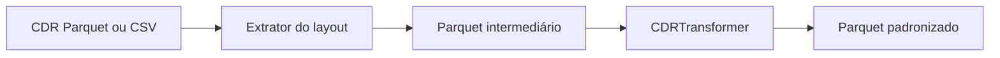

[](https://deepwiki.com/InovaFiscaliza/teleutils)

# TeleUtils

Biblioteca Python para normalizar dados de telecomunicações e processar
registros de chamadas (CDRs) de prestadoras brasileiras. O projeto oferece
funções para números telefônicos e CNPJs, além de extratores e transformadores
Apache Spark que convertem diferentes layouts de CDR em um contrato analítico
comum.

## Sumário

[Visão geral](#visão-geral)

<details>
<summary><a href="#início-rápido">Início rápido</a></summary>

- [Pré-requisitos](#pré-requisitos)
- [Instalação](#instalação)
- [Verificação da instalação](#verificação-da-instalação)

</details>

[Componentes e fluxo](#componentes-e-fluxo)

<details>
<summary><a href="#uso">Uso</a></summary>

- [Pré-processamento em Python](#pré-processamento-em-python)
- [Processamento de CDRs com Spark](#processamento-de-cdrs-com-spark)

</details>

[Estrutura do projeto](#estrutura-do-projeto)

[Documentação técnica](#documentação-técnica)

[Desenvolvimento](#desenvolvimento)

[Limitações conhecidas](#limitações-conhecidas)

[⬆ Voltar ao topo](#sumário)

## Visão geral

O `teleutils` atende dois cenários principais:

- normalização e validação de números telefônicos brasileiros, inclusive em
  pandas UDFs, e validação de CNPJ;
- extração de CDRs Parquet ou CSV para uma representação intermediária e
  transformação desse resultado em um dataset Parquet padronizado.

Os layouts de CDR disponíveis são Ericsson, LTE Huawei TIM, LTE Ericsson Vivo,
Nokia e Algar Huawei. O processamento usa Spark e grava os destinos em modo
`overwrite`; a saída transformada é particionada por `no_tipo_chamada`.

[⬆ Voltar ao topo](#sumário)

## Início rápido

### Pré-requisitos

- Python 3.9 ou superior;
- um ambiente Java funcional para os fluxos que iniciam o Apache Spark;
- Git para obter o repositório.

### Instalação

Com `uv`:

```bash
git clone https://github.com/InovaFiscaliza/teleutils.git
cd teleutils
uv sync
```

Para instalar apenas o pacote em um ambiente virtual já ativado:

```bash
python -m pip install .
```

### Verificação da instalação

Execute uma chamada que não precisa iniciar o Spark:

```bash
uv run python -c "from teleutils.preprocessing import normalize_number; print(normalize_number('(11) 99999-9999'))"
```

Resultado esperado:

```text
('11999999999', True)
```

[⬆ Voltar ao topo](#sumário)

## Componentes e fluxo



- `teleutils.preprocessing`: normalização de números e validação de CNPJ em
  Python ou por pandas UDF;
- `teleutils.core.extractors`: leitura, seleção, renomeação e enriquecimento de
  CDRs com metadados de origem;
- `teleutils.core.extractors.schemas`: contratos e catálogos dos layouts
  aceitos pelos extratores;
- `teleutils.core.transformers`: regras específicas por layout e pipeline comum
  de padronização do dataset final.

Os extratores derivam `prestadora`, `tipo_cdr` e `arquivo_origem` dos três
últimos componentes do caminho de cada arquivo. Organize a entrada no formato
`.../prestadora/tipo_cdr/arquivo` para preservar esses metadados.

[⬆ Voltar ao topo](#sumário)

## Uso

### Pré-processamento em Python

```python
from teleutils.preprocessing import normalize_number, validar_cnpj

numero, numero_valido = normalize_number("(11) 99999-9999")
cnpj_valido = validar_cnpj("11.222.333/0001-81")
```

Também estão disponíveis `normalize_number_pair`, `spark_normalize_number` e
`spark_validar_cnpj`. Consulte assinaturas e contratos na referência da API.

### Processamento de CDRs com Spark

Crie a sessão Spark antes de importar o transformador:

```python
from pyspark.sql import SparkSession

from teleutils.core.extractors import CDRParquetExtractor

spark = SparkSession.builder.appName("teleutils").getOrCreate()

from teleutils.core.transformers import CDRTransformer

extractor = CDRParquetExtractor(spark)
transformer = CDRTransformer(spark)

intermediario = extractor.extract_cdr_ericsson(
    source_file="dados/prestadora/ericsson/entrada.parquet",
    target_file="saida/intermediario/ericsson",
)
resultado = transformer.transform_cdr_ericsson(
    source_file=intermediario,
    target_file="saida/padronizado/ericsson",
)
```

Os métodos retornam o caminho de destino. Tanto a extração quanto a
transformação substituem dados já existentes no destino informado.

[⬆ Voltar ao topo](#sumário)

## Estrutura do projeto

```text
teleutils/
├── src/teleutils/
│   ├── core/
│   │   ├── extractors/       # extratores e schemas de layouts
│   │   └── transformers/     # transformação para o contrato final
│   └── preprocessing/        # números telefônicos e CNPJ
├── docs/                     # documentação técnica especializada
├── tests/                    # testes e materiais de desenvolvimento
└── pyproject.toml            # metadados e dependências do pacote
```

[⬆ Voltar ao topo](#sumário)

## Documentação técnica

| Documento | Descrição |
| :-- | :-- |
| [Referência da API](docs/teleutils_api.md) | Interfaces públicas, parâmetros, retornos, erros e efeitos colaterais. |
| [Linhagem e transformações dos dados](docs/teleutils_linhagem_transformacoes_dados.md) | Origem, regras de transformação e destino das colunas dos CDRs. |

[⬆ Voltar ao topo](#sumário)

## Desenvolvimento

Instale também as dependências de desenvolvimento e execute a suíte coletada
pelo pytest:

```bash
uv sync --all-groups
uv run pytest
```

O projeto configura `pytest`, `pre-commit` e ferramentas de notebook por meio
do grupo de dependências `dev` em `pyproject.toml`.

[⬆ Voltar ao topo](#sumário)

## Limitações conhecidas

- A suíte automatizada atual cobre a normalização de números; os fluxos Spark
  de extração e transformação não possuem testes automatizados coletados pelo
  pytest.
- A importação de `teleutils.core.transformers` requer um `SparkContext` ativo
  na implementação atual. Inicie uma `SparkSession` antes desse import.
- Os pipelines Spark dependem dos layouts e da organização de caminhos
  descritos na referência da API e na documentação de linhagem.